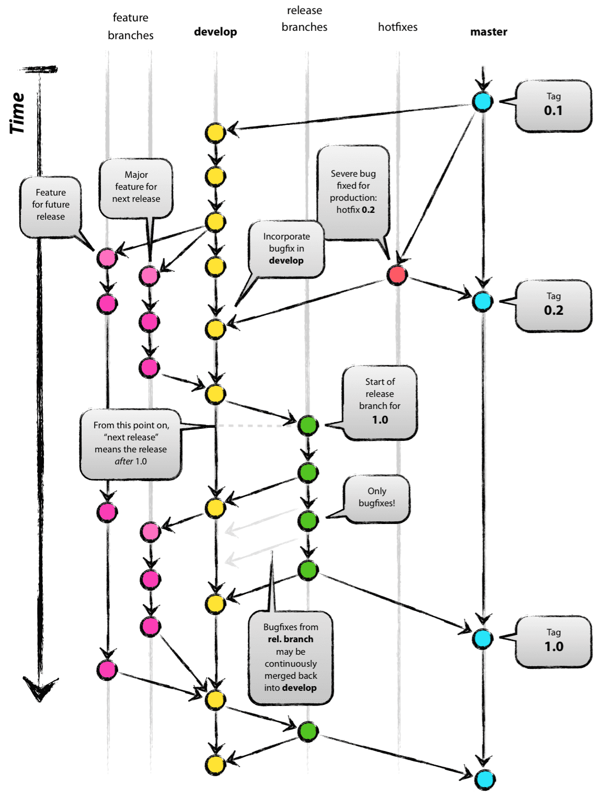

# **Git Branch 전략**


## Git-flow 브랜치 전략

master : 공식 릴리즈, develop 으로 분기, 버젼으로 관리

develop : git init 지점에서 master에서 분기하여 생성, 병합 지점

feature : 기능 개발을 위한 브랜치, develop 에서 분기하여 생성, 기능 완료시 develop에 병합

release : 배포를 위한 준비 단계, develop 에서 분기, 기능 개발 추가 하지 않고 버그 수정, 설명, 준비 작업만 한다. 배포시 master에 버젼으로 병합, develop에더 병합한다. 배포 후 release 브랜치는 삭제

hotfix : 빠른 패치를 위해 사용, master에서 분기, 작업 후 master, develop 에 병합 후 삭제

```
git-flow 브랜치 전략의 workflow
1. A develop branch is created from master
2. A release branch is created from develop
3. Feature branches are created from develop
4. When a feature is complete it is merged into the develop branch
5. When the release branch is done it is merged into develop and master
6. If an issue in master is detected a hotfix branch is created from master
7. Once the hotfix is complete it is merged to both develop and master
```

```
기본적인 명령어
- git log
- git log --oneline
- git log --oneline --all : 전체 브런치 log
- git log --oneline --all  --graph : 브랜치를 시각적으로 확인
- git branch : 브랜치 목록 확인
- git branch 브랜치이름 : 새로운 브랜치 생성
- git branch -d 브랜치이름 : 특정 브랜치 삭제(병합된 브랜치만 삭제)
- git branch -D 브랜치이름 : 강제 삭제
- git switch 브랜치이름 : 다른 브랜치로 이동
- git switch -c 브랜치이름 : 브랜치를 새로 생성과 동시에 이동


git checkout 은 변경, 복원 기능이 물려 있어서 이를 switch, restore 로 구분하여 나타냄(switch, restore 권장)
- 주의 사항 : git의 관리를 받고 있어야지만 버전관리가 된다 예) 마스터에서 브랜치로 이동하여 새로운 파일을 만들었지만 월킹 아레아에서 스테이징 아레아로 add, commit 하지 않았다면 이는 git tree에서 벗어나 관리되지 않아 관리가 꼬이게 된다.
```

working directory


staging area


remote (repository)


**Feature Branch**

기능 개발을 위한 브랜치

작은 기능 단위로 쪼개어 개발, 최대 10개 미만 커밋으로 구성되는 정도

naming rule : feature/{기능}

```bash
# branch 생성
git checkout -b feature/{기능}
```


**Commit**

커밋은 기능, 타입 단위로 짧게 끊어서 한다.

작업해야 할 양이 많더라도 여러번에 걸쳐 구분하여 커밋한다.

타입별로 구분하여 커밋 : 디버깅은 디버깅만, 소스 추가는 소스끼리 모아

커밋 후 push 하여 변경 내용 공유

```bash
# add로 Staging Area 로 옮기고 commit, description 은 최대한 자세히 작성
git add {edit file}
git commit -m "{기능} : {설명} "
# 작업 중인 branch 에서 push
git push --set-upstream origin {branch name}
```


**Commit Message**

```
type : subject  ==> {기능} : {설명}

body			==> {설명}

footer
```

정해보자


**Commit Type**

- feat : 새로운 기능 추가
- fix : 버그 수정, 기능 수정
- docs : 문서 수정
- refactor : 코드 리팩토링 (변수명 수정 등)
- test : 테스트 코딩
- style : 코드 스타일 변경, 코드 내용 변경하지 않음
- remove : 파일 또는 코드, 리소스 제거 등
- resource : 리소스 관련 (이미지 등)


**Subject**

- 50자를 넘기지 않고, 대문자 시작 마침표 없이 작성
- 현재시제 사용하며 명령어로 작성

```
feat : Add translation to missing strings
feat : Disable publishing
feat : Sort list context menu
feat : Resize minimize/delete handle icons so they take up the entire topbar
fix : Fix typo in cleanup.sh file
```

**Body**

- 선택사항
- 부가적인 설명이 필요할 경우 작성 or 커밋에 대해 설명
- 본문은 한글로 작성 가능


**Footer**

- 선택사항
- 이슈 트래킹을 위한 수단 중 하나


Example)

```
feat: Summarize changes in around 50 characters or less

More detailed explanatory text, if necessary. Wrap it to about 72
characters or so. In some contexts, the first line is treated as the
subject of the commit and the rest of the text as the body. The
blank line separating the summary from the body is critical (unless
you omit the body entirely); various tools like `log`, `shortlog`
and `rebase` can get confused if you run the two together.

Explain the problem that this commit is solving. Focus on why you
are making this change as opposed to how (the code explains that).
Are there side effects or other unintuitive consequenses of this
change? Here's the place to explain them.

Further paragraphs come after blank lines.

 - Bullet points are okay, too

 - Typically a hyphen or asterisk is used for the bullet, preceded
   by a single space, with blank lines in between, but conventions
   vary here

If you use an issue tracker, put references to them at the bottom,
like this:

Resolves: #123
See also: #456, #789
```


**git stash**

stash 는 현재 작업중인 브랜치에서 checkout 다른 브랜치로 이동시 커밋하지 않으면 이동이 안되는 경우 stash를 이용하여 임시보관하여 commit 하지 않고 이동 한다. 스택에 보관한 작업들은 나중에 꺼내와 작업할 수 있다.

```bash
# 궁금한게 stash에서 working directory 에서 트래킹 하고 있는 파일들을 전부 임시저장 해주는지 궁금??
git stash
git checkout develop

# stash 목록 확인
git stash

# 작업 중이던 거 가져오기
git stash apply		# 최근 stash를 가져온다
git stash apply [stash 이름]		# 특정 stash 가져온다
```


**병합**

시나리오 (마스터 기준 병합)

- fast-forward : 머지 하였지만 master 브랜치의 최신버전에서 나온 브랜치이기 때문에 머지 하였지만 커밋은 마스터와 브랜치가 합쳐진 버전이 되어 새로 생성 되지 않고 헤드가 마스터와  브랜치를 같이 가르킨다. 단순히 헤드가 최신버전으로 나아가는 것
- 3-way merge (merge commit) : 마스터 커밋과 브랜치 커밋의 공통 조상인 commit 을 기준으로 머지하여 새로운 커밋을 만들어 낸다.



**git merge**

3-way merge 는 conflict 를 알기 위해 공통 조상에 대해 알고 이를 통해 어느 부분이 수정되었고 어떤 충돌이 발생하였는지 알 수 있다.

공통 조상 없이 두 A, B 브랜치를 병합한다 가정하면 A에서 수정한 내용과 B에서 수정한 내용이 어떤게 기준이 되는지 명확하지 않게 된다.

**git rebase**

rebase에 개념은 브랜치에 분기 지점인 base 공통 조상 지점을 HEAD로 변경하는 것이다. fast-forward 머지

즉 분기되어 나온 브랜치가 없어지는 것 처럼 보이고(가비지 콜렉션 대상이 된다고 한다) HEAD에서 브랜치에 수정된 사항이 반영되어 commit 된것 처럼 보여진다. (즉 master 와 브랜치를 head가 같이 가르킨다)


머지를 위해 전략에 따라 두가지 방법 중 선택사항이다.

기록을 남겨야 하니 merge 를 통해 병합하자 (3-way merge)

필요시에만 commit 관련 정리는 rebase로 정리하자


**Pull Request**

Feature 개발이 끝나면 Branch를 병합하기 위해서 local 에서 merge 하지 않고 remote 에서 pull request 를 통해 병합한다.

PR은 멤버의 리뷰로 승인

github에서 PR 해봤는데 gitlab 에서 직접 해봐야 알거같다.


**git squash (git rebase -i)**

여러개 커밋을 하나로 합치는 경우 사용


**git commit --amend**

커밋 메세지 수정


**git push --force**

remote 에 이미 올란간 commit 을 변경 수정 한 경우 강제로 반영하기 위해 사용 주로 PR을 수정하거나 업데이트 할때 사용

수정사항 반영 commit 하고 rebase하고 commit squash -> push 이런 순서


**git cherry-pick**

다른 브랜치 commit 내용을 작업중인 브랜치에 적용시킬 경우 사용


reference

https://velog.io/@jinuku/Git-%EB%B8%8C%EB%9E%9C%EC%B9%98-%EC%A0%84%EB%9E%B5

https://velog.io/@jinuku/Git-%ED%98%91%EC%97%85-%EA%B0%80%EC%9D%B4%EB%93%9C

https://velog.io/@godori/Git-Rebase#rebase

https://git-scm.com/book/ko/v2/Git-%EB%B8%8C%EB%9E%9C%EC%B9%98-%EB%B8%8C%EB%9E%9C%EC%B9%98%EC%99%80-Merge-%EC%9D%98-%EA%B8%B0%EC%B4%88#_basic_merging
